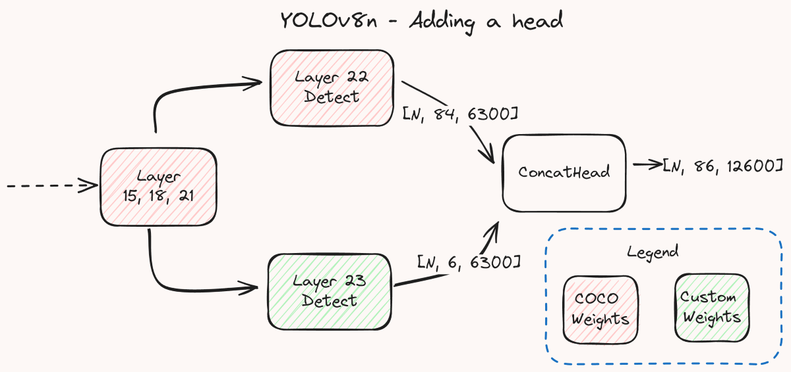
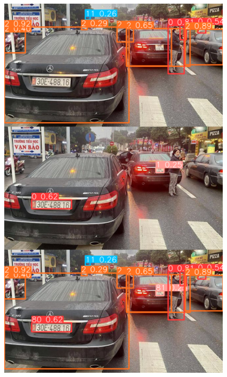

# yolov8_extend_class
## Setup
```
conda create -n <env_name> python==3.8
conda install pytorch==2.1.0 torchvision==0.16.0 torchaudio==2.1.0 pytorch-cuda=11.8 -c pytorch -c nvidia
conda activate <env_name>

git clone https://github.com/aTunass/yolov8_extend_class.git
cd yolov8_extend_class
python -m pip install -e .
```
## IDEA
Detail: You can refer to the following [blog](https://y-t-g.github.io/tutorials/yolov8n-add-classes/?fbclid=IwZXh0bgNhZW0CMTAAAR1R73t8LBE1SWqOeR5XVDGzKueaYdvZxYwmTFyyC03bkwZJpXeGIFVIRDI_aem_Aby_tewyau0Mf2aR_jbASpqXfPImBrD0XnL1weYWMvPfRAXVhqAkkvaB1AJaq-8CJUGSc3SfQvwncqXDiW1zhqUT), all my code is taken from this blog
- 
Summary: You have trained the yolov8 model with 80 classes previously with the COCO set, now you have new labels to add to the model. Instead of retraining the entire model with 81 classes, you can keep the original model and train a new model with frozen backbone and the output is 1 additional class. Then we take the two head classes of these two models and concat them together and go with the backbone that was initially used or frozen.
## Training
you can use code example_training.py for training. Note, freeze the backbone before training
## Predict
After the following training you get two model weights. In example_predict.py there will be code segments such as "check", "save dict", "load model" and "predict". You can try each one while commenting on the others. after going through two steps "check" and "save dict". you run both "load model" and "predict"
## Export, Validate
You can follow the remaining codes from [Ultralytics](https://github.com/ultralytics/ultralytics)
## Example result
- 
## Reference
- [Y-T-G](https://github.com/Y-T-G)
- [Ultralytics](https://github.com/ultralytics/ultralytics)